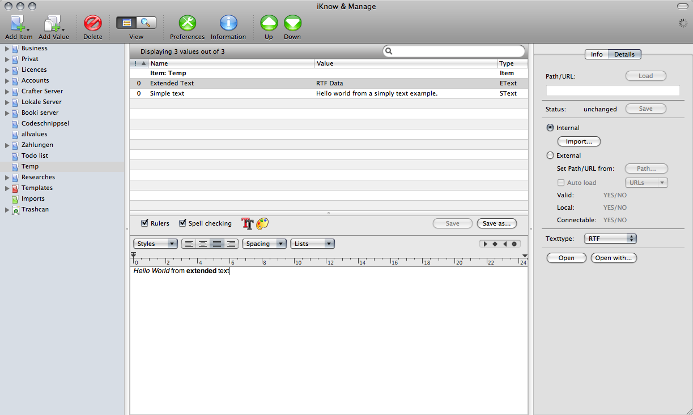
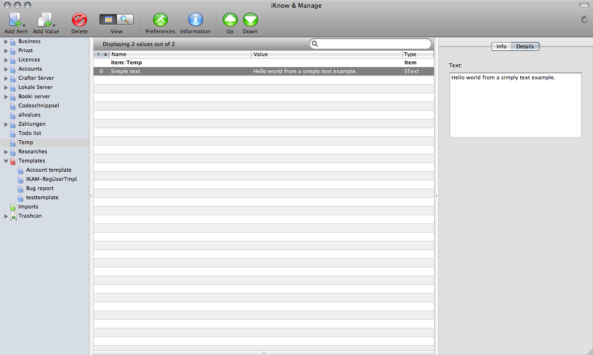
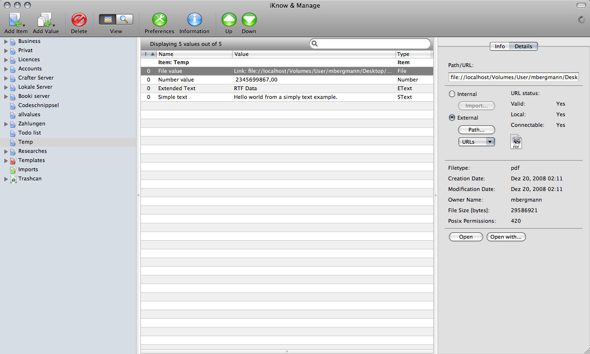
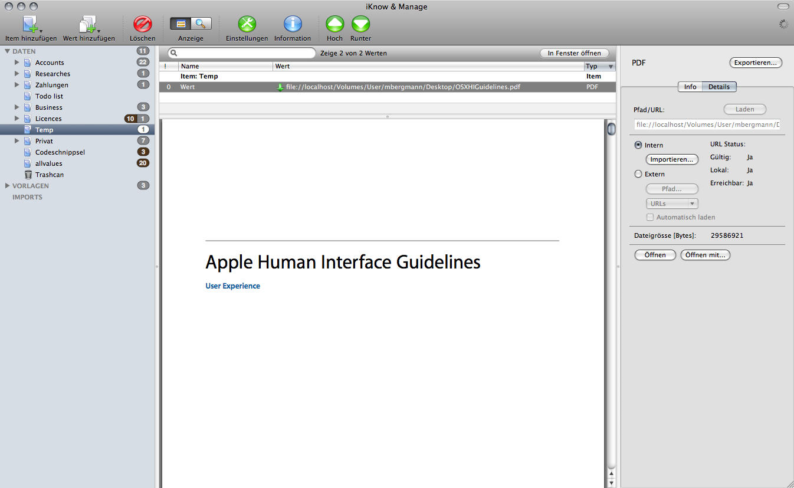
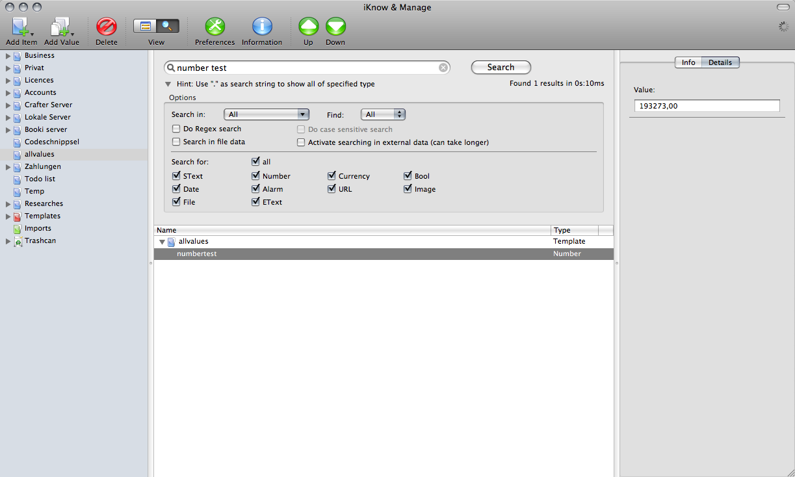

# iKnow & Manage

Organize, store and create all your information, your thoughts, and even files, images and PDFs in a flexible data hierarchy with a SQL database as backend.

## Features

- Uses Sqlite, a lightweight but strong and well known SQL database for the data storage. A dynamic and highly extendable data structure has been implemented to store all the data.
- No limit of data, except the free hard drive space.
- Single Instance storage mechanism. That means that data which has the same signature is only stored once internally which saves disk space. For example if you import the same image twice in different places it will in fact only be stored once.
- Has built-in datatypes like text, rich text, number, currency, bool, date, date range including alarm option, URL, PDF, image, file. With those datatypes you can easily manage all your imformation.
- Date datatype can be configured as range and with alarm.
- File datatype can link to files on the local filesystem or on the internet.
- Supports Growl for alarm notification (Growl has to be installed on your system).
- Template elements can be created or converted from existing elements for often used data.
- For data you need in more than one place you can define an unlimited number of aliases of a datatype or an item.
- Supports Drag & Drop and Copy & Paste for reorganizing (moving objects) and for importing and exporting data.
- Has built-in search engine which finds all your data easily and fast.
- Data can be encrypted with a strong password based encryption algorithm.
- Uses Keychain to store your encryption password.
- Print support for you data.
- Your data can be exported to the filesystem so that it can be easily shared with other users or for backups.
- Has a rich text editor built-in which also supports images.
- Has an image and PDF viewer built-in to view your images just in place, no need for external applications.
- Uses Sparkle for easy and reliable application updating.
- Runs native on Intel-Macs.

## Screenshots

Extended text

Simple text

File

Image

PDF

Search

## More details

License:
iKnow & Manage is Shareware. But it is not available anymore.
The plan is to make it open source sometime in the future. But there was no time to do this yet.

UPDATE (1.6.2018):
As of now iKnow & Manage is open-source. The source code and new releases are available on GitHub.
A build for macOS 10.13 is available as download there.
The current updated sources work under latest Xcode (9.4) and macOS (10.13) systems and will be updated further.
